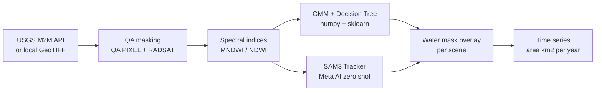
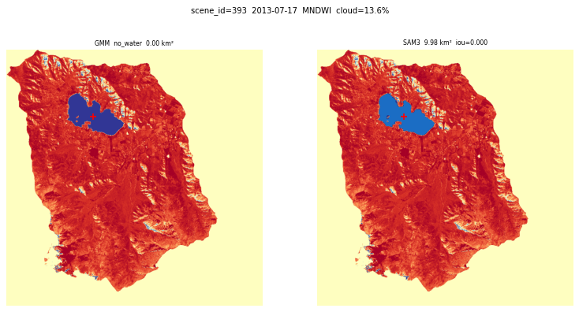
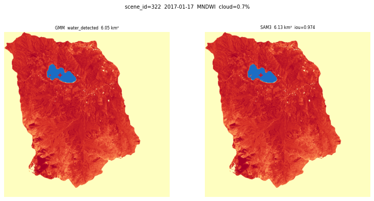
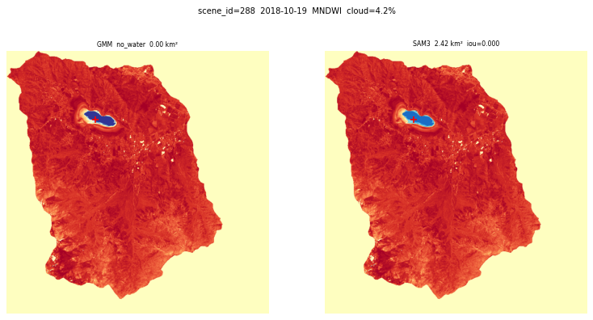
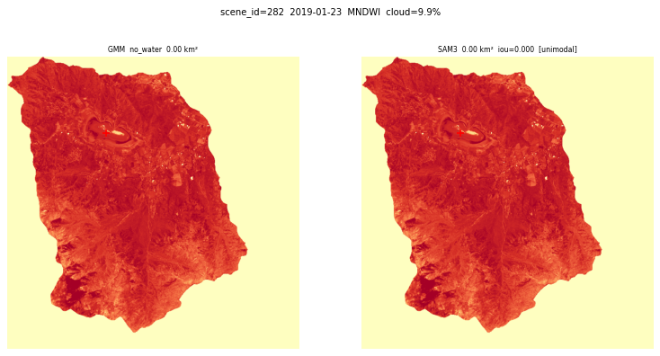
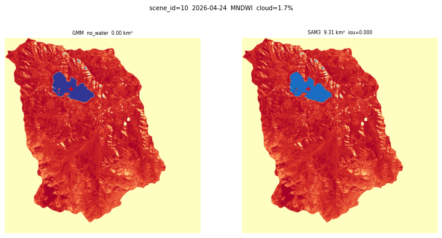
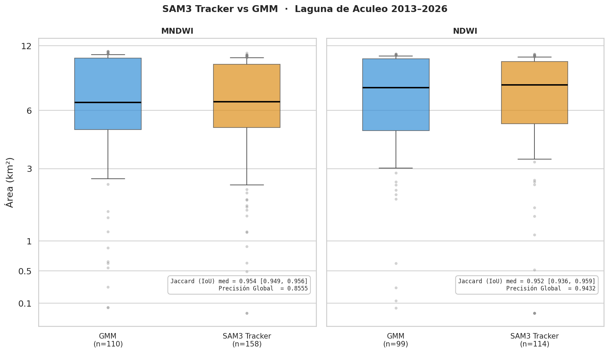
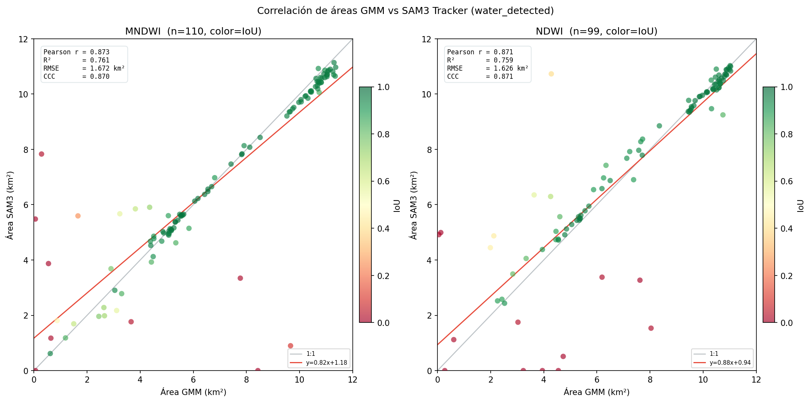
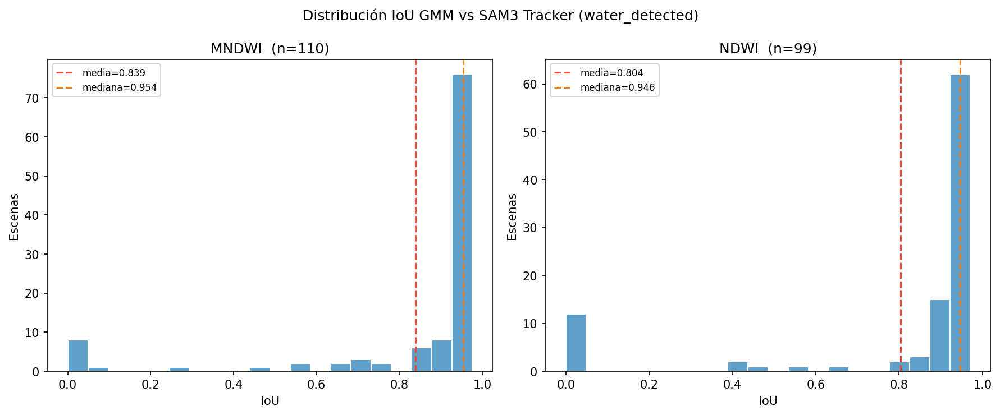
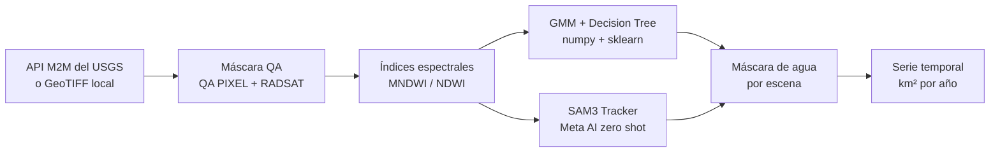

<div align="center">

# hydrotrack notebook

**Storytelling notebook · monitoreo satelital de cuerpos de agua sin base de datos**

[](https://github.com/negentropy-technologies/hydrotrack_notebook/actions/workflows/ci.yml)
[](https://www.python.org/)
[](LICENSE)
[](https://colab.research.google.com/github/negentropy-technologies/hydrotrack_notebook/blob/main/notebook/aculeo_story.ipynb)

<br/>

[](https://pytorch.org/)
[](https://huggingface.co/facebook/sam3)

[English](#overview) · [Español](#resumen)

</div>

---

## Overview

A self contained Jupyter notebook that tells the full story of the **Laguna de Aculeo** (Chile) disappearance and partial recovery between 2013 and 2026, using only local GeoTIFF files. No PostGIS. No SSH. No database.

One scene per year. QA masking. MNDWI and NDWI indices. Water detection with SAM3 Tracker (zero shot) and GMM + Decision Tree. Time series area chart. Runs on any laptop or on Google Colab.



### Five key moments · Laguna de Aculeo 2013 to 2026

**July 2013 · Full lake at ~10 km² · GMM no_water · SAM3 = 9.98 km²**



**January 2017 · Declining · GMM 6.05 km² · SAM3 6.13 km² · IoU 0.974**



**October 2018 · Critical drought · GMM no_water · SAM3 = 2.42 km²**



**January 2019 · Dry · both detectors confirm zero water surface**



**April 2026 · Recovery · GMM no_water · SAM3 = 9.31 km²**



### Benchmark · SAM3 Tracker vs GMM + Decision Tree · 705 scenes 2013 to 2026

| Metric | MNDWI | NDWI |
|--------|-------|------|
| Total scenes (per index) | 353 | 352 |
| GMM + Decision Tree water_detected | 110 | 99 |
| SAM3 Tracker water_detected | 157 | 111 |
| Both detectors agree (IoU subset) | 108 | 95 |
| Precision (agreement with GMM+DT) | 0.902 | 0.858 |
| Recall (agreement with GMM+DT) | 0.906 | 0.908 |
| F1 (agreement with GMM+DT) | 0.891 | 0.873 |
| IoU mean (co-detected subset) | 0.854 | 0.838 |
| IoU median (co-detected subset) | 0.954 | 0.952 |
| **Overall Agreement (OA) scene-level** | **0.856** | **0.943** |

SAM3 Tracker recovers scenes that the GMM bimodality filter rejects. Additional detections concentrate in 2018-2019 and 2022-2023.

**Area distribution · GMM vs SAM3 log scale**



**Area correlation with IoU as color**



**IoU histogram for scenes with water detected**



### Sensor roadmap

| Release | Sensor | Notes |
|---------|--------|-------|
| v0.1.0 | Landsat 8/9 OLI TIRS | Current |
| v0.2.0 | Sentinel 2 MSI L2A | 10 m, SCL quality mask |
| v0.3.0 | Sentinel 1 GRD SAR | cloud independent, Otsu threshold |

---

## Quick Start

```bash
git clone https://github.com/negentropy-technologies/hydrotrack_notebook.git
cd hydrotrack_notebook
python -m venv .venv && source .venv/bin/activate
pip install -r requirements.txt
cp .env.example .env
jupyter notebook notebook/aculeo_story.ipynb
```

Or open directly in Google Colab with the badge above.

### GPU acceleration (SAM3)

SAM3 Tracker requires **torch 2.7.1+cu128**. Only CUDA 12.8 is validated.

```bash
# CUDA 12.8 (required for SAM3 Tracker compatibility)
pip install torch torchvision --index-url https://download.pytorch.org/whl/cu128

# Check your CUDA version first
nvidia-smi
```

---

## Project Structure

```
hydrotrack_notebook/
├── notebook/
│   └── aculeo_story.ipynb    storytelling notebook (self contained)
├── data/
│   └── scenes/               downloaded GeoTIFF files (gitignored)
├── docs/
│   └── assets/               benchmark and story images
│       └── LANDSAT_QA_BANDS.md
├── requirements.txt
├── environment.yml
└── .env.example
```

---

## License

Apache License 2.0 — free for any use including commercial.

---

## Resumen

Notebook de storytelling que narra la desaparición y recuperación parcial de la **Laguna de Aculeo** (Chile, 2013 a 2026) usando solo archivos GeoTIFF locales. Sin base de datos ni servidor. Funciona en cualquier laptop o en Google Colab.

Detección de agua con SAM3 Tracker (Meta AI, zero shot) y GMM + Decision Tree estadístico. Una escena por año. Gráfica de serie temporal de área en km².



### Cinco momentos clave · Laguna de Aculeo 2013 a 2026

**Julio 2013 · Lago pleno ~10 km² · GMM no_water · SAM3 = 9.98 km²**


**Enero 2017 · En declive · GMM 6.05 km² · SAM3 6.13 km² · IoU 0.974**


**Octubre 2018 · Sequía crítica · GMM no_water · SAM3 = 2.42 km²**


**Enero 2019 · Seco · ambos detectores confirman cero superficie**


**Abril 2026 · Recuperación · GMM no_water · SAM3 = 9.31 km²**


### Benchmark · SAM3 Tracker vs GMM + Decision Tree · 705 escenas 2013 a 2026

| Métrica | MNDWI | NDWI |
|---------|-------|------|
| n escenas totales (por índice) | 353 | 352 |
| n escenas GMM water_detected | 110 | 99 |
| n escenas SAM3 water_detected | 157 | 111 |
| n escenas ambos detectan (subconjunto IoU) | 108 | 95 |
| Precisión (concordancia con GMM) | 0,902 | 0,858 |
| Recall (concordancia con GMM) | 0,906 | 0,908 |
| F1 (concordancia con GMM) | 0,891 | 0,873 |
| IoU media (subconjunto ambos) | 0,854 | 0,838 |
| IoU mediana (subconjunto ambos) | 0,954 | 0,952 |
| **Precisión Global (OA) escena-nivel** | **0,856** | **0,943** |

SAM3 recupera escenas que el filtro de bimodalidad del GMM rechaza. Las detecciones adicionales se concentran en 2018-2019 y 2022-2023.

**Distribución de áreas · GMM vs SAM3 escala logarítmica**


**Correlación de área con IoU como color**


**Histograma IoU para escenas con agua detectada**


### Hoja de ruta de sensores

| Versión | Sensor | Notas |
|---------|--------|-------|
| v0.1.0 | Landsat 8/9 OLI TIRS | Actual |
| v0.2.0 | Sentinel 2 MSI L2A | 10 m, máscara SCL |
| v0.3.0 | Sentinel 1 GRD SAR | independiente de nubes, umbral Otsu |

---

## Inicio rápido

```bash
git clone https://github.com/negentropy-technologies/hydrotrack_notebook.git
cd hydrotrack_notebook
python -m venv .venv && source .venv/bin/activate
pip install -r requirements.txt
cp .env.example .env
jupyter notebook notebook/aculeo_story.ipynb
```

O abre directamente en Google Colab con el badge de arriba.

### Aceleración GPU (SAM3)

SAM3 Tracker requiere **torch 2.7.1+cu128**. Solo CUDA 12.8 está validado.

```bash
# CUDA 12.8 (requerido para compatibilidad con SAM3 Tracker)
pip install torch torchvision --index-url https://download.pytorch.org/whl/cu128

# Verifica tu versión de CUDA primero
nvidia-smi
```

---

## Estructura del proyecto

```
hydrotrack_notebook/
├── notebook/
│   └── aculeo_story.ipynb    notebook de storytelling (autocontenido)
├── data/
│   └── scenes/               archivos GeoTIFF descargados (gitignored)
├── docs/
│   └── assets/               imágenes del benchmark y del storytelling
│       └── LANDSAT_QA_BANDS.md
├── requirements.txt
├── environment.yml
└── .env.example
```

---

## Licencia

Apache License 2.0 — libre para cualquier uso incluido el comercial.

---

> Para el pipeline de producción completo con PostGIS, orquestación Prefect y soporte multi-sensor, ver [hydrotrack](https://polar.sh/negentropy-technologies).